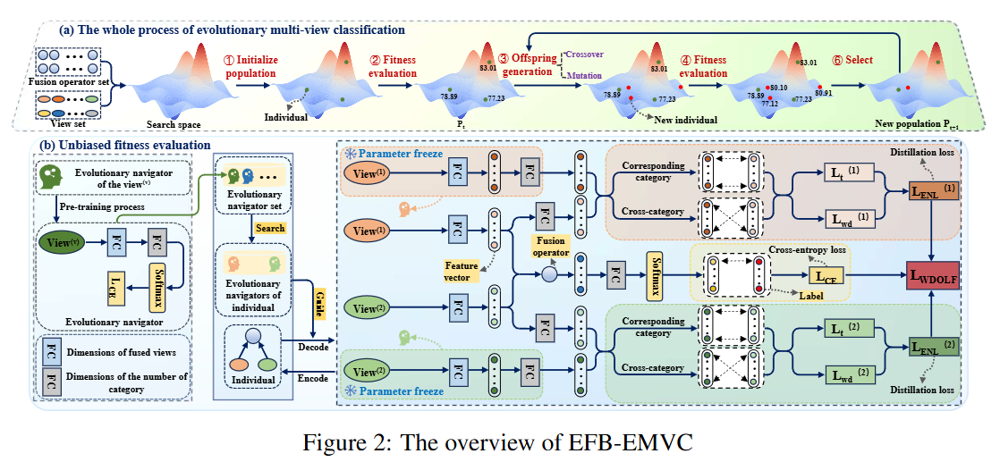

_**This paper has been accepted to NeurIPS 2025 as a Spotlight.**_

<h2 align="center"> <a href="https://nips.cc/virtual/2025/poster/115223">Evolutionary Multi-View Classification via Eliminating Individual Fitness Bias</a></h2>

<div align="center">

**[Xinyan Liang<sup>1,2</sup>](https://xinyanliang.github.io/), [_Shuai Li_<sup>1</sup>](https://github.com/LiShuailzn), _Qian Guo_<sup>3</sup>, [_Yuhua Qian_<sup>1*</sup>](http://dig.sxu.edu.cn/qyh/),  _Bingbing Jiang_<sup>4</sup>, _Tingjin Luo_<sup>5</sup>, _Liang Du_<sup>1</sup>**

<sup>1</sup>Institute of Big Data Science and Industry, Shanxi University<br>
<sup>2</sup>State Key Laboratory of AI Safety, Beijing, 100086<br>
<sup>3</sup>School of Computer Science and Technology, Taiyuan University of Science and Technology<br>
<sup>4</sup>School of Information Science and Technology, Hangzhou Normal University<br>
<sup>5</sup>College of Science, National University of Defense Technology<br>


<a href='https://nips.cc/virtual/2025/poster/115223'></a>&nbsp;

</div>


## Abstract
Evolutionary multi-view classification (EMVC) methods have gained wide recognition due to their adaptive mechanisms. Fitness evaluation (FE), which aims to calculate the classification performance of each individual in the population and provide reliable performance ranking for subsequent operations, is a core step in such methods. Its accuracy directly determines the correctness of the evolutionary direction.
However, when FE fails to correctly reflect the superiority-inferiority relationship among individuals, it will lead to confusion in individual performance ranking, which in turn misleads the evolutionary direction and results in trapping into local optima. This paper is the first to identify the aforementioned issue in the field of EMVC and call it as fitness evaluation bias (FEB).
FEB may be caused by a variety of factors, and this paper approaches the issue from the perspective of view information content: existing methods generally adopt joint training strategies, which restrict the exploration of key information in views with low information content. This makes it difficult for multi-view models (MVM) to achieve optimal performance during convergence, which in turn leads to FE failing to accurately reflect individual performance rankings and ultimately triggering FEB.
To address this issue, we propose an evolutionary multi-view classification via eliminating individual fitness bias approach (EFB-EMVC). This approach alleviates the FEB problem by introducing evolutionary navigators for each MVM, thereby providing relatively accurate individual ranking.
Experimental results fully verify the effectiveness of the proposed method in alleviating the FEB problem, and the EMVC method equipped with this strategy exhibits more superior performance compared with the original EMVC method.

## 🏗️Model
<div align="center">
  
</div>

## 🎞️Experiment
In this experiment, we aim to investigate the effectiveness of EN in alleviating the FEB problem.
### Data
We used nine multi-view datasets in this experiment:

| Datasets            | Original Dataset URL | Original Password | Processed Dataset URL | Processed Password |
|---------------------|----------------------|------------------|-----------------------|--------------------|
| MVoxCeleb           | [link]()             |                  | [link]()              |                    |
| YoutubeFace         | [link]()             |                  | [link]()              |                    |
| NUS-WIDE-128 (NUS)  | [link]()             |                  | [link]()              |                    |
| Reuters5            | [link]()             |                  | [link]()              |                    |
| Reuters3            | [link]()             |                  | [link]()              |                    |
| CB                  | [link]()             |                  | [link]()              |                    |
| MM-IMDB             | [link]()             |                  | [link]()              |                    |
| NTU RGB-D           | [link]()             |                  | [link]()              |                    |
| EgoGesture          | [link]()             |                  | [link]()              |                    |


To facilitate code reproducibility, we have provided all necessary resources within each dataset link, including the five-fold split data, teacher model logits and soft labels, as well as the kernel and mutual information matrices required for the experiments. Readers can directly download and use them.

### Experiment Workflow
To mitigate the FEB problem, we introduce EN into each view branch of MVM. EN is designed as a pre-trained network with the same architecture as the teacher model. Accordingly, the experimental workflow consists of: (1) pre-training EN and extracting logits; (2) constructing the mutual information matrix; (3) the EMVC method driven by unbiased fitness evaluation.

#### Training
1. **Pre-training EN and extracting logits**
```bash
python code/train_T.py
python code/gain_T_logits.py
```
2. **Constructing the mutual information matrix**
```bash
python code/HSIC/kernel_matrix.py.py
python code/HSIC/HSIC.py.py
```
3. **The EMVC method driven by unbiased fitness evaluation**
```bash
python code/train_tree_youtube.py
```

## 📑Citation
If you find this repository useful, please cite our paper:
```
@inproceedings{
liang2025EFB-EMVC,
title={Evolutionary Multi-View Classification via Eliminating Individual Fitness Bias},
author={Xinyan Liang, Shuai Li, Qian Guo, Yuhua Qian, Bingbing Jiang, Tingjin Luo, Liang Du},
booktitle={Proceedings of the Thirty-ninth Annual Conference on Neural Information Processing Systems (NeurIPS-25)},
year={2025},
}
```

## 🔬 Related Work
We list below the works most relevant to this paper, including but not limited to the following:
- Trusted multi-view classification via evolutionary multi-view fusion [[paper]](https://openreview.net/pdf?id=M3kBtqpys5)
- DC-NAS: Divide-and-conquer neural architecture search for multi-modal classification [[paper]](https://ojs.aaai.org/index.php/AAAI/article/view/29281)
- Core-structures-guided multi-modal classification neural architecture search [[paper]](https://www.ijcai.org/proceedings/2024/0440.pdf)
- CoMO-NAS: Core-structures-guided multi-objective neural architecture search for multi-modal classification [[paper]](https://dl.acm.org/doi/10.1145/3664647.3681351)
- Evolutionary deep fusion method and its application in chemical structure recognition [[paper]](https://ieeexplore.ieee.org/document/9373673)

<!-- ## 🙏 Acknowledgement -->


## 📬Contact
If you have any detailed questions or suggestions, you can email us: [lishuai_liuzhaona@163.com](mailto:lishuai_liuzhaona@163.com)
